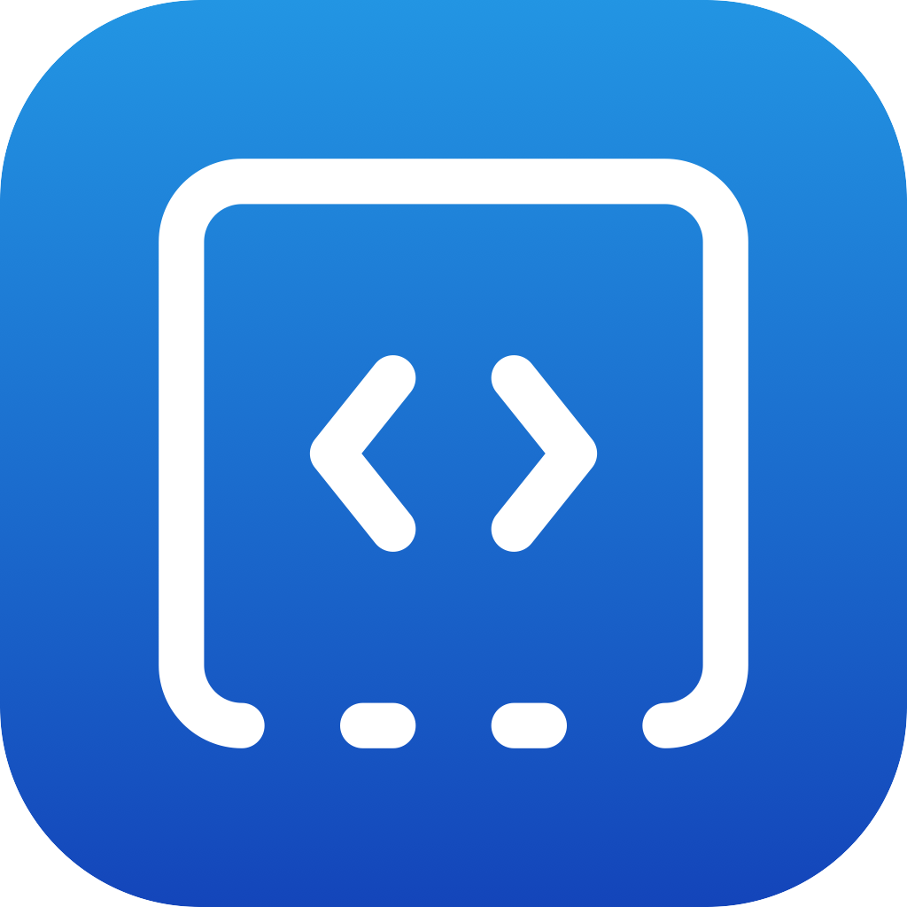

<p align="center">
  
</p>

<h1 align="center">CodeDock</h1>

<p align="center">
  A macOS menu-bar icon that lists your projects
  and opens the chosen one in your favorite terminal with opencode inside.
  I built this because I never liked juggling shell aliases for this.
  <br />
  <strong>Status: alpha — macOS only for now.</strong>
</p>

<p align="center">
  
  
  
  
  
</p>

---

CodeDock lives in the menu bar.
Point it at one or more base folders and every subfolder shows up as a project:
click one and it opens in your chosen terminal with
[opencode](https://opencode.ai) running inside.

## Supported terminals

There is no universal "open this folder and run this command" API on macOS,
so each terminal is driven with its own documented mechanism. CodeDock
detects installed terminals (`.app` bundle in `/Applications` or
`~/Applications`, plus the CLI on `PATH` / well-known locations) and marks
them in the picker; unavailable ones are labeled `(not installed)` but stay
selectable in case you install them later.

| Terminal   | How it opens                                                                         | New tab vs new window                                    |
| ---------- | ------------------------------------------------------------------------------------ | -------------------------------------------------------- |
| Ghostty    | AppleScript `surface configuration` (`initial working directory` + `command`) ([docs](https://ghostty.org/docs/features/applescript)) | New tab in the front window; new window if none |
| Terminal.app | AppleScript `do script "cd … && exec …"`                                           | Always a new window (no tab API)                         |
| iTerm2     | AppleScript `create window/tab …` + `write text` ([docs](https://iterm2.com/documentation-scripting.html)) | New tab in the current window; new window if none |
| Warp       | URI scheme `warp://action/new_tab?path=…` ([docs](https://docs.warp.dev/terminal/more-features/uri-scheme/)) | New tab if running; new window on cold start |
| Alacritty  | CLI: `alacritty --working-directory <dir> -e <opencode>`                              | Always a new window (Alacritty has no tabs)              |
| Kitty      | CLI: `kitty --directory <dir> <opencode>`                                            | Always a new OS window (tabs would need remote control in `kitty.conf`) |
| WezTerm    | CLI: `wezterm cli spawn --cwd <dir> -- <opencode>`, falling back to `wezterm start` ([docs](https://wezterm.org/cli/cli/spawn.html)) | New tab if running; new window on cold start |

> **Warp limitation:** Warp's URI scheme can only open a folder — it cannot
> run a command in the new tab (see
> [warpdotdev/Warp#5859](https://github.com/warpdotdev/Warp/issues/5859) and
> [#5405](https://github.com/warpdotdev/Warp/issues/5405)). With Warp,
> CodeDock opens the project folder and you run `opencode` yourself. The app
> shows a hint under the picker when Warp is selected.

`open -a <Terminal> --args …` is deliberately not used: most terminals ignore
CLI args when already running, which is exactly the case CodeDock optimizes for.

## Configuration

CodeDock reads `codedock.config.json` from the user config directory
(`~/Library/Application Support/dev.codedock.app` on macOS).
A missing or broken file falls back to defaults; individually invalid entries
are dropped without breaking the rest.

```json
{
  "baseDirs": ["/Users/you/Documents/Programs"],
  "disabledProjects": ["/Users/you/Documents/Programs/OldDemo"],
  "opencodeBin": null,
  "terminal": "ghostty",
  "sortMode": "name",
  "language": "en",
  "theme": "auto"
}
```

| Field         | Description                                                        |
| ------------- | ------------------------------------------------------------------ |
| `baseDirs`    | Parent folders; each direct (non-hidden) subfolder is a project    |
| `disabledProjects` | Project paths hidden from the window list and the menu-bar menu (managed in the "Visible projects" panel with Select all / Select none, per folder and globally; missing = everything visible) |
| `opencodeBin` | Path to the opencode binary; `null` = auto-detect only             |
| `terminal`    | One of `ghostty`, `terminal`, `iterm2`, `warp`, `alacritty`, `kitty`, `wezterm`; unknown/missing = `ghostty` |
| `sortMode`    | `"name"` = global alphabetical; `"base"` = grouped by base folder (then name); unknown/missing = `"name"` |
| `language`    | `"auto"` = follow the system (default); `"en"` = English; `"es"` = Spanish; unknown explicit values = `"en"` (also accepts locale tags like `es-ES`) |
| `theme`       | `"auto"` = follow the OS color scheme (default); or one of the 8 curated ids (`codedock-dark`, `abyss-blue`, `ember-dusk`, `kelp-night`, `orchid-haze`, `codedock-light`, `harbor-mist`, `parchment`); unknown = `"auto"` |

## Tests

- **Frontend** — `npm test` (Vitest): project filtering/sorting/grouping and
  selection wrapping, language resolution (`auto` vs manual) with an EN/ES
  parity gate (no empty strings), theme resolution and the WCAG 2.1 AA
  contrast gate over the shipped `style.css` tokens, and a version-sync test
  keeping `package.json`, `tauri.conf.json` and `Cargo.toml` from drifting.
- **Backend** — `cargo test` (in `src-tauri/`): tolerant config parsing
  (defaults, `snake_case` compat, per-field fallbacks, one sanitizing
  round-trip, unknown keys ignored), folder scanning (ordering, hidden, files,
  missing bases), `~` expansion, opencode binary resolution (override vs
  auto-detect, localized errors), per-terminal script/argv builders plus
  terminal detection — all without launching any terminal.


## License

[MIT](LICENSE) — © 2026 [Cayetano97](https://github.com/Cayetano97).
